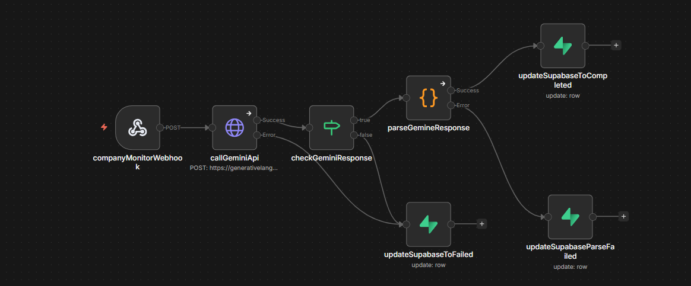

# Fluna Take-Home Assessment — Company Mention Monitor

A system that monitors recent web mentions of a company in the context of climate tech and cleantech investment. Given a company name, it searches the web using Gemini AI with Google Search grounding, extracts structured information, and stores the result in Supabase.

## Architecture

```
POST /submit-company-mention
        ↓
Supabase Edge Function (validation, deduplication, row creation)
        ↓
n8n Webhook (background processing)
        ↓
Gemini 2.5 Flash API (web search grounding)
        ↓
Supabase Database (stores result, updates status)
```

The Edge Function responds immediately while n8n processes in the background. The database record is created with status `Running` at the start and updated to `Completed` or `Failed` when processing finishes. The frontend can use Supabase Realtime to listen for updates.

---

## Setup From Scratch

### Prerequisites

- Supabase account
- n8n cloud account (n8n.io)
- Gemini API key (aistudio.google.com)
- Supabase CLI installed

### 1. Database Migration

Run the SQL migration in **Supabase Dashboard → SQL Editor**:

```sql
CREATE TABLE IF NOT EXISTS company_mentions (
  id UUID DEFAULT gen_random_uuid() PRIMARY KEY,
  company_name TEXT NOT NULL,
  requestor TEXT,
  status TEXT DEFAULT 'Running' CHECK (status IN ('Running', 'Completed', 'Failed')),
  mentions_output JSONB,
  error_message TEXT,
  quality_score INTEGER CHECK (quality_score BETWEEN 0 AND 100),
  quality_reasoning TEXT,
  created_at TIMESTAMPTZ DEFAULT NOW(),
  updated_at TIMESTAMPTZ DEFAULT NOW()
);

CREATE INDEX idx_company_mentions_company_status
ON company_mentions (company_name, status, created_at DESC);

ALTER PUBLICATION supabase_realtime ADD TABLE company_mentions;
```

Then enable Realtime on the `company_mentions` table in **Supabase Dashboard → Database → Replication**.

### 2. n8n Workflow

1. Sign up at [n8n.io](https://n8n.io)
2. Create a new workflow
3. Import `company-mention-monitor.json` via **Import from file**
4. Add your credentials:
   - **Supabase:** Add your Supabase project URL and service role key
   - **Gemini API:** Replace `YOUR_GEMINI_API_KEY` in the HTTP Request node URL with your actual key from [aistudio.google.com](https://aistudio.google.com)
5. Publish the workflow
6. Copy the production webhook URL

### 3. Supabase Edge Function

**Login and link your project:**

```bash
supabase login
supabase link --project-ref YOUR_PROJECT_REF
```

**Set environment variable:**

```bash
supabase secrets set N8N_WEBHOOK_URL=YOUR_N8N_PRODUCTION_WEBHOOK_URL
```

**Deploy the function:**

```bash
supabase functions deploy submit-company-mention
```

---

## Testing

### Trigger a full end-to-end run

**curl:**

```bash
curl -X POST https://oyclirixdcyokrxfvekx.supabase.co/functions/v1/submit-company-mention \
  -H "Content-Type: application/json" \
  -d '{"companyName": "Northvolt", "requestor": "analyst@fluna.co"}'
```

**Postman:**

- Method: `POST`
- URL: `https://oyclirixdcyokrxfvekx.supabase.co/functions/v1/submit-company-mention`
- Header: `Content-Type: application/json`
- Body:

```json
{
  "companyName": "Northvolt",
  "requestor": "analyst@fluna.co"
}
```

**Expected immediate response:**

```json
{
  "id": "uuid-here",
  "company_name": "Northvolt",
  "requestor": "analyst@fluna.co",
  "status": "Running",
  "created_at": "2026-03-04T10:00:00Z"
}
```

After 30-60 seconds, query Supabase to see the completed result:

```sql
SELECT * FROM company_mentions
WHERE company_name = 'Northvolt'
ORDER BY created_at DESC
LIMIT 1;
```

---

## Design Decisions

**1. Edge Function as thin proxy**
The Supabase Edge Function handles validation, deduplication, and row creation — then immediately delegates processing to n8n. This keeps the Edge Function fast and focused while n8n handles the heavier AI and parsing work.

**2. Respond immediately, process in background**
The Edge Function responds with `202 Accepted` before n8n finishes processing. This prevents timeouts and gives the caller an `id` they can use to poll or subscribe to updates via Supabase Realtime.

**3. Gemini with Google Search grounding**
Using Gemini's built-in Google Search grounding ensures the results are based on real, recent web content rather than the model's training data — which is critical for a news monitoring system.

**4. Quality score generated by AI**
Rather than writing a separate scoring algorithm, the quality score is generated by Gemini as part of the same API call. Gemini evaluates recency, source credibility, and relevance to cleantech investment and returns a score with reasoning. This leverages the model's understanding of what makes a source reliable.

**5. Composite index on company_name, status, created_at**
Queries frequently filter by company name and status together, then sort by date. A composite index on these three columns is more efficient than separate indexes.

**6. Multi-level error handling in n8n**
The workflow handles failures at three distinct points. First, if the Gemini API call fails (e.g. rate limiting, network error), the HTTP Request node is configured to continue via its error output branch, routing directly to `updateSupabaseToFailed` with a descriptive error message — for example, a 429 error is translated to a human-readable "Gemini API 429: Resource exhausted (quota/rate limit exceeded)" rather than exposing a raw API error. Second, if the Gemini API call succeeds but returns an empty or malformed response, the IF node catches this and routes to `updateSupabaseToFailed`. Third, if the response looks valid but fails JSON parsing in the Code node, that error is also caught and routed to a separate `updateSupabaseParseFailed` node. This means the database row is always updated to either `Completed` or `Failed` — it never gets stuck in `Running` indefinitely.

---

## Bonus Features

### 1. Duplicate Submission Handling

The Edge Function checks for a `Completed` result for the same company within the last 30 days before triggering a new workflow. If found, it returns the cached result immediately with `"cached": true`. It also checks for any currently `Running` request for the same company to prevent duplicate processing.

### 2. Result Quality Metric

Each result includes a `quality_score` (0-100) and `quality_reasoning` generated by Gemini. The score is based on:

- Recency of the mentions
- Relevance to cleantech/climate investment
- Source credibility
- Number of high-relevance mentions found

These are stored in dedicated columns (`quality_score`, `quality_reasoning`) separate from the main `mentions_output` JSONB.

---

## What I Would Do Differently With More Time

The current duplicate handling always returns a cached result if one exists within 30 days. With more time I would add a `forceRefresh` flag to the request body — for example `"forceRefresh": true` — that allows analysts to bypass the cache and trigger a fresh search when they specifically need the most current data. This would give teams more control over when to use cached results versus when to fetch new ones, without removing the efficiency benefits of caching for routine requests.

---

## n8n Workflow Canvas



---

## Repository Structure

```
fluna-take-home-zainab/
├── README.md
├── company-mention-monitor.json
├── migrations/
│   └── 001_create_company_mentions.sql
└── supabase/
    └── functions/
        └── submit-company-mention/
            └── index.ts
```
